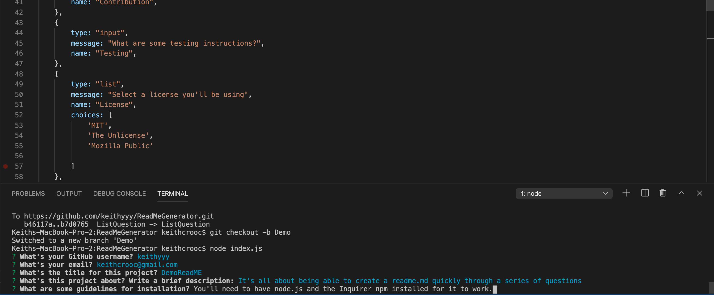

# ReadMeGenerator
Using Node.js and the Command Line Interface to make a ReadME.md generator!

## Node.js

With this exercise, users will be able to create a README.md file by answering a series of questions. 

Through the Command Line Interface, the series of questions related to the project will be prompted. 
With every response, the answer is then translated onto a markdown file. 

The readme markdown will be then created and can be found in the "ReadMeBin" folder.

It's important to note that in order for the series of question to be prompted, users will need to have node & inquirer installed.
Just in case you find a video of it in actions below 👇

**You can find a link to the video here!** - https://youtu.be/Wkk5o1Au6to

**Here's a screenshot of the command line in action**

